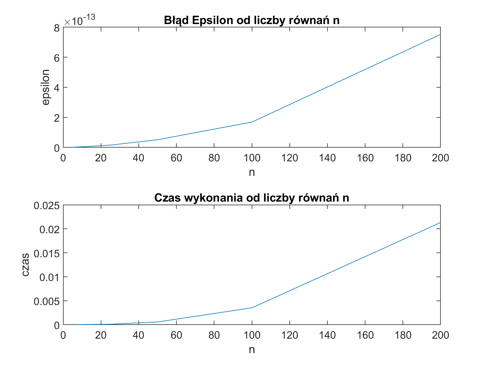
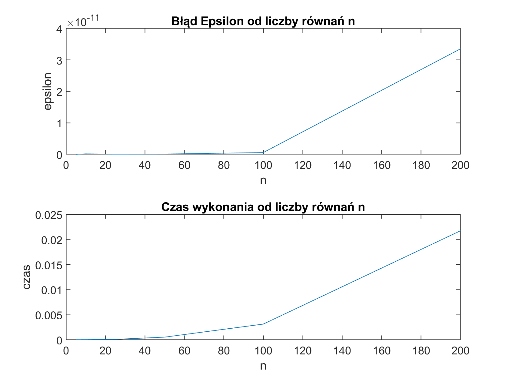
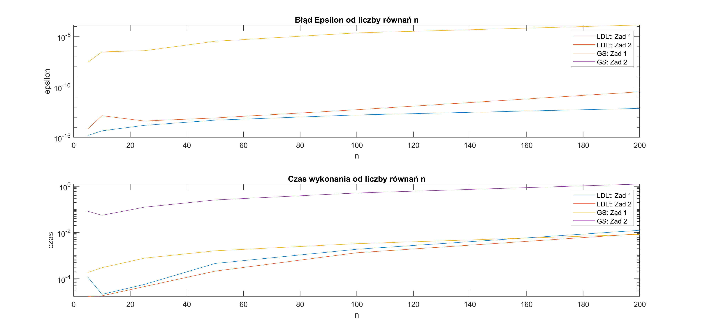
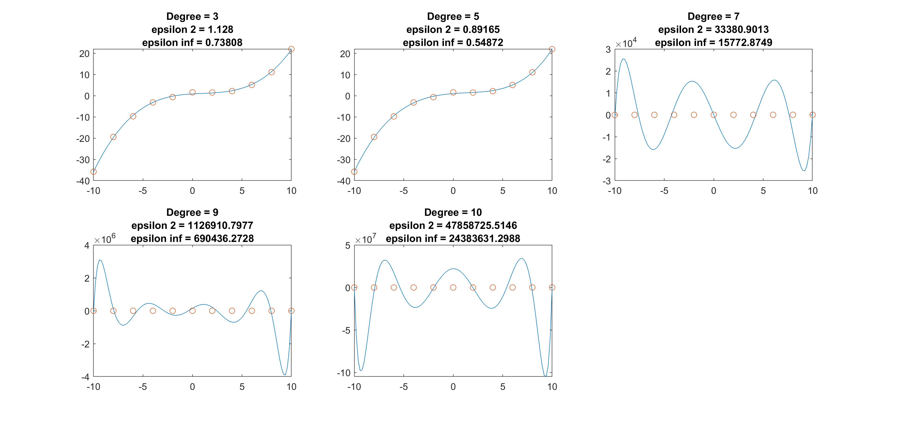
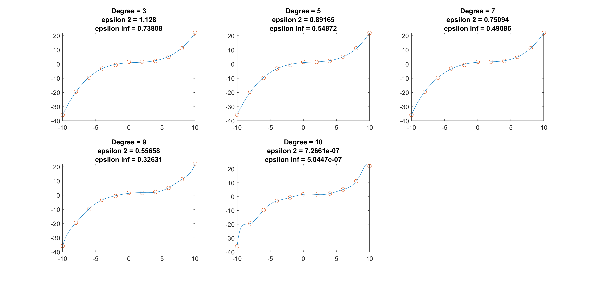

# MNUM Miniprojekt 1
_Richard Staszkiewicz idx. 310918_

<!-- https://snip.mathpix.com/2barti2/notes/f1b9f837-1234-4295-99ed-258c7a7ed446/edit -->

## Zadanie 1
### Treść
Napisać uniwersalną procedurę w Matlabie o odpowiednich parametrach wejścia i wyjścia (solwer),
rozwiązującą układ n równań liniowych Ax = b, gdzie x, b ∈ Rn, wykorzystując podaną metodę. 
Nie sprawdzać w procedurze, czy dana macierz A spełnia wymagania stosowalności metody. 
Zakazane jest użycie jakichkolwiek solwerów w środku. Obliczyć błąd rozwiązania ε = ∥A˜x − b∥2 (skorzystać
z funkcji norm Matlaba).
Metoda: faktoryzacji LDLT
Proszę wykonać wykresy zależności czasu obliczeń i błędu ε od liczby równań n. Skomentować wyniki

### Dane
#### Macierz A

$$
\begin{equation}
  a_{ij} = \begin{cases}
    2 (i + j) + 1, & \text{dla $j \neq i $}\\
    4n^2 + (2i + 4) n, & \text{dla $j = i$}\\
  \end{cases}
\end{equation}
$$

Implementacja generacji znajduje się w pliku [Generate_A1](generate_A1.m)

Przykładowa macierz A dla n = 5:
```
   130     7     9    11    13
     7   140    11    13    15
     9    11   150    15    17
    11    13    15   160    19
    13    15    17    19   170
```

Cechy:Symetryczna, Silna dominacja diagonalna

Dominacja diagonalna została zweryfikowana z pomocą funkcji zaimplementowanej w pliku [testDiagonalDomminance](testDiagonalDomminance.m), która zwróciła dla każdej wartości n wartość True.

#### Macierz b

$$
\begin{equation}
  b_{i} = 2.5 + 0.6i
\end{equation}
$$

Implementacja generacji znajduje się w pliku [Generate_B1](generate_B1.m)

Przykładowa macierz b dla n = 5:
```
    3.1000
    3.7000
    4.3000
    4.9000
    5.5000
```

#### Wartości n
n = 5, 10, 25, 50, 100, 200

### Rozwiązanie
Z treści wynika że nie należy sprawdzać symetryczności i dodatniego określenia macierzy A.  Wynik zostaje wyznaczony na podstawie rozwiązania układów równań z macierzami trójkątnymi:

$$
Ax = LDL^T x = L(DL^T x) = b
$$

$$
y = DL^T x
$$

$$
Ax = Ly = b
$$

gdzie macierze $L$ i $DL^T$ są macierzami trójkątnymi.

Najpierw rozwiązujemy układ $Ly=b$ w poszukiwaniu $y$, a następnie podstawiamy wyliczoną wartość do układu $DL'x=y$ i rozwiązujemy w poszukiwaniu $x$.
Implementacja funkcji reprezentującej ten algorytm znajduje się w pliku [solveLDLt](solveLDLt.m)

#### Metoda faktoryzacji $LDL^T$

Algorytm faktoryzacji najłatwiej osiągnąć poprzez przedstawienie macierzy $A$ jako iloczyn macierzy $L$ oraz $DL^T$, gdzie $L$ jest macierzą trójkątną dolną z jedynkami na diagonali a $D$ jest macierzą diagonalną.

$$
\begin{bmatrix}
    a_{11} & a_{12} & ... & a_{1n} \\
    a_{21} & a_{22} & ... & a_{2n} \\
    ... & ... & ... & ... \\
    a_{n1} & a_{n2} & ... & a_{nn} \\
\end{bmatrix}
=
\begin{bmatrix}
    1 & 0 & ... & 0 \\
    \overline{l}_{21} & 1 & ... & 0 \\
    ... & ... & ... & ... \\
    \overline{l}_{n1} & \overline{l}_{n2} & ... & 1 \\
\end{bmatrix}
 \begin{bmatrix}
    d_{11} & d_{12} \overline{l}_{21} & ... & d_{1n} \overline{l}_{n1} \\
    0 & d_{22} & ... & d_{2n} \overline{l}_{n2} \\
    ... & ... & ... & ... \\
    0 & 0 & ... & d_{nn} \\
\end{bmatrix}
$$

Kolejno rozwiązując równania skalarne jesteśmy w stanie przedstawić to działanie w postaci algorytmu.


Algorytm:

$$
d_{ii} = a_{ii} - \sum_{k = 1}^{i-1} {\overline{l}_{ik}^2 d_{kk}}
$$

$$
\overline{l}_{ji} = ({a_{ji} -  \sum_{k=1}^{i-1} {\overline{l}_{jk} d_{kk} \overline{l}_{ik}}}) / d_{ii}, i = 1, ..., n, j = i + 1, ..., n
$$

Implementacja powyższego algorytmu znajduje się w pliku [factorizeLDLt](factorizeLDLt.m).

#### Macierz trójkątna dolna
Mając podane równanie $Ax = b$ wartości $x$ można wyznaczać iteracyjnie za pomocą kolejnych równań liniowych z jedną niewiadomą za pomocą algorytmu:

$$
x_1 = \frac{b_1}{a_{11}}
$$

$$
x_k = \frac{b_k - \sum_{j = 1}^{k - 1} {a_{kj} x_j}}{a_{kk}}, k = 2, 3, ..., n
$$

Implementacja powyższego algorytmu znajduje się w pliku [solveLowerTriangle](solveLowerTriangle.m)

#### Macierz trójkątna górna
Podobnie jak część dolną, mając podane równanie $Ax = b$ wartości $x$ można wyznaczać iteracyjnie za pomocą kolejnych równań liniowych z jedną niewiadomą za pomocą algorytmu:

$$
x_n = \frac{b_n}{a_{nn}}
$$

$$
x_k = \frac{b_k - \sum_{j = k + 1}^{n} {a_{kj} x_j}}{a_{kk}}, k = n - 1, n - 2, ..., 1
$$

Implementacja powyższego algorytmu znajduje się w pliku [solveUpperTriangle](solveUpperTriangle.m)

### Obliczanie błędu i reprezentacja graficzna
Wykorzystując wzór na błąd Epsilon od liczby równań n w postaci $\varepsilon = ∥A\tilde{x} − b∥_2$ i funkcji wbudowanych Matlaba do wizualizacji otrzymano następujące przebiegi:



Implementacja powyższej wizualizacji znajduje się w pliku [plotZEpsilon](plotZEpsilon.m)

## Zadanie 2
### Treść
Wykonać eksperymenty takie jak w p. 1 dla macierzy A i wektorów b danych wzorami:
aii = −12; aij = 4.5, j = i ± 2; aij = 0 dla pozostałych; bi = −3.5 + 0.5i, używając swojego
solwera z p. 1 oraz solwera GS.m ze strony przedmiotu, będącego implementacją metody Gaussa-
Seidela. Przyjąć itmax=1000 · n, delta=10−8 ≜ 1e − 8. Przedstawić wyniki (dokładności i czasy) w
tabelach i wykresach, porównać je i skomentować.

### Dane
#### Macierz A

$$
\begin{equation}
  a_{ij} = \begin{cases}
    -12, & \text{dla $j = i$}\\
    4.5, & \text{dla $j = i \pm 2$}\\
    0, & \text{dla pozostałych}
  \end{cases}
\end{equation}
$$

Implementacja generacji znajduje się w pliku [Generate_A2](generate_A2.m)

Przykładowa macierz A dla n = 5:
```
  -12.0000    4.5000    4.5000         0         0
    4.5000  -12.0000    4.5000    4.5000         0
    4.5000    4.5000  -12.0000    4.5000    4.5000
         0    4.5000    4.5000  -12.0000    4.5000
         0         0    4.5000    4.5000  -12.0000
```

Cechy:Symetryczna, wstęgowa

Dominacja diagonalna została zweryfikowana z pomocą funkcji zaimplementowanej w pliku [testDiagonalDomminance](testDiagonalDomminance.m), która zwróciła dla każdej wartości n wartość False.


#### Macierz b

$$
\begin{equation}
  b_{i} = -3.5 + 0.5i
\end{equation}
$$

Implementacja generacji znajduje się w pliku [Generate_B2](generateB2.m)

Przykładowa macierz b dla n = 5:
```
   -3.0000
   -2.5000
   -2.0000
   -1.5000
   -1.0000
```


#### Wartości n
n = 5, 10, 25, 50, 100, 200

### Rozwiązanie
Do zadanych A i b zastosowano omówiony w pkt. 1 solver [solveLDLt](solveLDLt.m) oraz udostępniony na stronie przedmiotu solver [GS](GS.m).

### Obliczanie błędu i reprezentacja graficzna
Wykorzystując wzór na błąd Epsilon od liczby równań n w postaci $\varepsilon = ∥A\tilde{x} − b∥_2$ i funkcji wbudowanych Matlaba do wizualizacji otrzymano następujące przebiegi:



Implementacja powyższej wizualizacji znajduje się w pliku [plotZEpsilon](plotZEpsilon.m)

Dokonując konkatenacji z rezultatami z Zadania 1 i wynikami dla solvera GS o implementacji w pliku [plotConcatenate](plotConcatenate.m) otrzymać można następujące przebiegi:



**Uwaga!** Skala Y jest logarytmiczna

### Wnioski
1. Macierz z Zadania 2 nie jest macierzą o dominacji diagonalnej, w związku z czym nie można zastosować do niej metody Gaussa-Seidla.
2. Wykorzystanie rozkładu $LDL^t$ dla macierzy z obu zadań działało relatywnie efektywnie, osiągając dla przykłądowych N $/eps < 10^(-10)$ co przy danych całkowitych jest rozsądnym wynikiem.
3. Zarówno błąd jak i czas obliczeń metodą rozkładu $LDL^t$ zdają się pozostawać w relatywnie liniowym stosunku zarówno do siebie jak i do ilości równań n.
4. Metoda Gaussa-Seidla działa zauważalnie wolniej i z zauważalnie większym błędem niż rozkład $LDL^t$.

## Zadanie 3

### Treść
Dla podanych w tabeli danych pomiarowych (próbek) metodą najmniejszych kwadratów należy wyznaczyć funkcję wielomianową y = f(x) (tzn. wektor współczynników) najlepiej aproksymującą te dane.
Proszę przetestować wielomiany stopni: 3, 5, 7, 9, 10, 11. Kod aproksymujący powinien być uniwersalną procedurą w Matlabie o odpowiednich parametrach wejścia i wyjścia. Do rozwiązania zadania najmniejszych kwadratów proszę wykorzystać:
a. Układ równań normalnych i swój solwer z p. 1,
b. Układ równań normalnych i solwer GS.m,
c. Rozkład SVD; do faktoryzacji użyć odpowiedniego solwera Matlaba.
Obliczać błąd aproksymacji w normach euklidesowej ∥.∥2 oraz maksimum ∥.∥∞ (proszę użyć funkcji norm(.,inf)), porównać efektywność trzech podejść. Przedstawić na rysunku otrzymane funkcje na tle danych (funkcję aproksymującą proszę próbkować przynajmniej 10 razy częściej niż dane). Do liczenia wartości wielomianu użyć funkcji polyval. Skomentować.

### Dane
#### Punkty do aproksymacji

| $x_i$ | -10 | -8 | -6 | -4 | -2 | 0 | 2 | 4 | 6 | 8 | 10 |
| :---: | :---: | :---: | :---: | :---: | :---: | :---: | :---: | :---: | :---: | :---: | :---: |
| $y_i$ | 39.655 | 14.615 | 2.613 | -1.011 | -0.839 | 0.550 | -0.045 | -1.870 | -4.916 | -3.668 | 2.008 |

#### Stopnie wielomianów

$S_p$ = {3, 5, 7, 9, 10}

### Rozwiązanie

#### Metoda Najmniejszych Kwadratów
Metoda Najmniejszych Kwadratów jest statystyczną procedurą znajdowania linii najlepszego dopasowania. Minimalizuje ona błąd średniokwadratowy między znalezionym rozwiązaniem a zadanymi w próbie wartościami przy podanym stopniu rozwiązania D.

$$
\forall x \in \mathbb{R}  || b - A \hat{x} \leqslant b - A x ||
$$

#### Układ równań normalnych
Metoda układu równań normalnych wymaga rozwiązania układu równań $A^t A \hat{x} = A^t b$ gdzie macierz $A$ jest macierzą współczynników wyznaczaną na podstawie zadanych wartości X:

$$
A_{ij} = {x_i}^j
$$

Wektor $b$ jest równy wektorowi $y^T$.
Implementacja znajdowania macierzy współczynników znajduje się w pliku [generate_A3](generate_A3.m).
Implementacja aproksymacji układami równań normalnych znajduje się w pliku [approximateNormal](approximateNormal.m).

#### Rozkład SVD
Metoda aproksymacji z użyciem rozkładu SVD macierzy A polega na rozwiązaniu układu:

$$
\hat{x} = A^{+} b
A^{+} = V \sigma^{+} U^T
$$

Gdzie $V$ , $\sigma$ i $U$ pochodzą z rozkładu SVD macierzy A i służą do obliczenia jej pseudoinwersji.
Implementacja aproksymacji z wykorzystaniem rozkładu SVD znajduje się w pliku [approximateSVD](approximateSVD.m).

#### Wizualizacja
Za pomocą funkcji wbudowanych matlaba do wizualizacji danych zareprezentowano każde z rozwiązań. Rezultaty ukazują poniższe wykresy:

##### Równania normalne + rozkład $LDL^T$


##### Równania normalne + metoda Gaussa-Seidla


##### Rozkład SVD


Implementacja skryptu generującego wykresy dostępna jest w pliku [plotZ3](plotZ3.m).

#### Wnioski
1. Najlepiej aproksymuje podany zbiór metoda utylizującą równania normalne i rozkład $LDL^T$
2. Niewiele gorzej od wspomnianej w pkt. 1 metody radzi sobie rozkład SVD - różnica dotyczy tylko jednego stopnia, jednak jest rzędu wielkości $10^3$.
3. O ile dla małych stopni metoda używająca GS sobie radzi, o tyle dla wyższych stopni wielomianów zaczyna rozbiegać. Dzieje się tak, ponieważ macierz $A$ po przekroczeniu 5 stopnia przestaje być przekątniowo dominująca nie speniając w związku z tym wymogów metody.
4. Zawsze wartym wspomnienia jest tendencja do malenia błędu wraz ze wzrostem stopnia aproksymującego wielomianu. Przytoczyć tu można twierdzenie, że w wypadku liczby próbek mniejszej bądź równej stopniowi wielomianu aproksymującego, problem sprowadza się do interpolacji wielomianowej.

## Skrypty

### generate_A1.m
```matlab
function [A] = generate_A1(n)
    A = zeros(n, n);

    for i = 1 : n
        for j = 1 : n
            A(i, j) = 2 * (i + j) + 1;
        end
    end
    
    for i = 1 : n
        A(i, i) = 4 * n * n + (2 * i + 4) * n;
    end
end
```

### testDiagonalDomminance.m
```matlab
function d = testDiagonalDomminance(A)
    [n, ~] = size(A);
    d = true;
    for i = 1 : n
        if (sum(abs(A(i, :))) - abs(A(i, i))) > abs(A(i, i))
            d = false;
        end
    end
end
% Sprawdza dominację diagonalną
% A - macierz symetryczna
% d - czy macierz A ma dominację diagonalną?
```

### generate_B1.m
```matlab
function [b] = generate_B1(n)
    b = zeros(n, 1);
    for i = 1 : n
        b(i, 1) = 2.5 + 0.6 * i;
    end
end
```

### solveLDLt.m
```matlab
function x = solveLDLt(A, b)
        % A = LDL'
        [L, D] = factorizeLDLt(A);
        % solve equation Ly = b for y
        y = solveLowerTriangle(L, b);
        % solve equation DL' x = y for x
        x = solveUpperTriangle(D * L', y);
end
```

### factorizeLDLt.m
```matlab
function [L, D] = factorizeLDLt(A)
    [n, ~] = size(A);
    L = zeros(n, n);
    D = zeros(n, n);
    
    for i = 1 : n
        L(i, i) = 1;
        D(i, i) = A(i, i);

        for k = 1 : i - 1
            D(i, i) = D(i, i) - L(i, k) ^ 2 * D(k, k);
        end
        
        for j = i + 1 : n
            L(j, i) = A(j, i);
            for k = 1 : i - 1
                L(j, i) = L(j, i) - L(j, k) * D(k, k) * L(i, k);
            end
            L(j, i) = L(j, i) / D(i, i);
        end
    end
end
```

### solveLowerTriangle.m
```matlab
function x = solveLowerTriangle(A, b)
    % solve linear equation with lower triangular matrix
    [n, ~] = size(A);
    x = zeros(n, 1);

    for k = 1 : n
        x(k, 1) = b(k, 1);
        
        for j = 1 : k - 1
            x(k, 1) = x(k, 1) - A(k, j) * x(j, 1);
        end

        x(k, 1) = x(k, 1) / A(k, k);
    end
end
```

### solveUpperTriangle.m
```matlab
function x = solveUpperTriangle(A, b)
    % solve linear equation with upper triangular matrix
    [n, ~] = size(A);
    x = zeros(n, 1);
    
    for k = n : -1 : 1
        x(k, 1) = b(k, 1);
        
        for j = k + 1 : n
            x(k, 1) = x(k, 1) - A(k, j) * x(j, 1);
        end

        x(k, 1) = x(k, 1) / A(k, k);
    end
end
```

### plotZEpsilon.m
```matlab
function plotZEpsilon(generate_A, generate_B, iter)
    N = [5 10 25 50 100 200];
    [EA, TA] = analyzeAlgorithm(generate_A, generate_B, iter, N);
    
    tiledlayout(2, 1);
    
    nexttile
    plot(N, EA);
    title('Błąd Epsilon od liczby równań n');
    xlabel('n');
    ylabel('epsilon');

    nexttile
    plot(N, TA);
    title('Czas wykonania od liczby równań n');
    xlabel('n');
    ylabel('czas');
end

function [EA, TA] = analyzeAlgorithm(generate_A, generate_B, iter, N)
    EA = zeros(size(N));
    TA = zeros(size(N));

    for k = 1 : iter
        epsilonsA = zeros(size(N));
        timesA = zeros(size(N));
    
        i = 1;
        for n = N
            A = generate_A(n);
            b = generate_B(n);
            [epsilonsA(i), timesA(i)] = solveAndGetEpsilon(A, b);
            i = i + 1;
        end
        EA = EA + epsilonsA;
        TA = TA + timesA;
    end

    EA = EA / iter;
    TA = TA / iter;
end

function [epsilon, time] = solveAndGetEpsilon(A, b)
    tic
    x = solveLDLt(A, b);
    time = toc;
    epsilon = norm(A * x - b, 2);
end
```

### generate_A2.m
```matlab
function [A] = generate_A2(n)
    A = zeros(n, n);

    for i = 1 : n
        A(i, i) = -12;
    end
    
    for i = 2 : n
        A(i, i - 1) = 4.5;
        A(i - 1, i) = 4.5;
    end

    for i = 3 : n
        A(i, i - 2) = 4.5;
        A(i - 2, i) = 4.5;
    end
end
```

### generate_B2.m
```matlab
function [b] = generate_B2(n)
    b = zeros(n, 1);
    for i = 1 : n
        b(i, 1) = -3.5 + 0.5 * i;
    end
end
```

### plotConcatenate.m
```matlab
function [EA_GS1, EA_GS2] = plotConcatenate(iter)
    N = [5 10 25 50 100 200];
    [EA1, TA1] = analyzeAlgorithm(@generate_A1, @generate_B1, iter, @solveAndGetEpsilonLDLt, N);
    [EA2, TA2] = analyzeAlgorithm(@generate_A2, @generate_B2, iter, @solveAndGetEpsilonLDLt, N);
    [EA_GS1, TA_GS1] = analyzeAlgorithm(@generate_A1, @generate_B1, iter, @solveAndGetEpsilonGS, N);
    [EA_GS2, TA_GS2] = analyzeAlgorithm(@generate_A2, @generate_B2, iter, @solveAndGetEpsilonGS, N);
    tiledlayout(2, 1);
    
    nexttile
    plot(N, EA1, N, EA2, N, EA_GS1, N, EA_GS2);
    legend('LDLt: Zad 1', 'LDLt: Zad 2', 'GS: Zad 1', 'GS: Zad 2');
    title('Błąd Epsilon od liczby równań n');
    xlabel('n');
    ylabel('epsilon');
    set(gca, 'YScale', 'log')

    nexttile
    plot(N, TA1, N, TA2, N, TA_GS1, N, TA_GS2);
    legend('LDLt: Zad 1', 'LDLt: Zad 2', 'GS: Zad 1', 'GS: Zad 2');
    title('Czas wykonania od liczby równań n');
    xlabel('n');
    ylabel('czas');
    set(gca, 'YScale', 'log')
end

function [EA, TA] = analyzeAlgorithm(generate_A, generate_B, iter, solveAndGetEpsilon, N)
    EA = zeros(size(N));
    TA = zeros(size(N));

    for k = 1 : iter
        epsilonsA = zeros(size(N));
        timesA = zeros(size(N));
    
        i = 1;
        for n = N
            A = generate_A(n);
            b = generate_B(n);
            [epsilonsA(i), timesA(i)] = solveAndGetEpsilon(A, b, n);
            i = i + 1;
        end
        EA = EA + epsilonsA;
        TA = TA + timesA;
    end

    EA = EA / iter;
    TA = TA / iter;
end

function [epsilon, time] = solveAndGetEpsilonLDLt(A, b, ~)
    tic
    x = solveLDLt(A, b);
    time = toc;
    epsilon = norm(A * x - b, 2);
end

function [epsilon, time] = solveAndGetEpsilonGS(A, b, n)
    tic
    x = GS(A, b, 1e-8, n * 1000);
    time = toc;
    epsilon = norm(A * x - b, 2);
end
```

### generate_A3.m
```matlab
function [A] = generate_A3(X, Y, degree)
    N = size(Y, 1);
    A = zeros(N, degree + 1);
    for i = 1 : N
        for j = 1 : degree + 1
            A(i, j) = X(i) ^ (j - 1);
        end
    end
end
```

### approximateNormal.m
```matlab
function [x] = approximateNormal(X, Y, degree, useGS)
    A = generate_A3(X, Y, degree);
    
    if useGS
        x = GS(A' * A, A' * Y, 1e-8, 1000 * degree);
    else
        x = solveLDLt(A' * A, A' * Y);
    end
end
```

### approximateSVD.m
```matlab
function [x] = approximateSVD(X, Y, degree)
    A = generate_A3(X, Y, degree);

    [U, S, V] = svd(A);

    sigma = S(1 : size(A, 2), :);
    sigma_plus = [ inv(sigma) zeros(size(A, 2), size(A, 1) - size(A, 2))];
    A_plus = V * sigma_plus * U';
    x = A_plus * Y;
end
```

### plotZ3.m
```matlab
function [result] = plotZ3(strategy)

    N = [3, 5, 7, 9, 10];
    
    for i = 1 : length(N)
        degree = N(i);
        nexttile
        
        X = -10:2:10;
        Y = [-35.798, -19.430, -9.737, -3.163, -0.650, 1.587, 1.517, 2.183, 5.102, 11.091, 22.000]';
        resolution = -10:0.2:10;
        
        if strategy == 0
            result = approximateNormal(X, Y, degree, 0);
        elseif strategy == 1
            result = approximateNormal(X, Y, degree, 1);
        else
            result = approximateSVD(X, Y, degree);
        end
    
        result = result(end:-1:1);
    
        polynomial_values = polyval(result, X);
        epsilon_2 = norm(polynomial_values - Y');
        epsilon_inf = norm(polynomial_values - Y', "inf");
    
        plot(resolution , polyval(result, resolution), X, Y, 'o');
    
        title({['Degree = ' num2str(degree)] ...
            ['epsilon 2 = ' num2str(epsilon_2)] ...
            ['epsilon inf = ' num2str(epsilon_inf)]});
    end
end
```