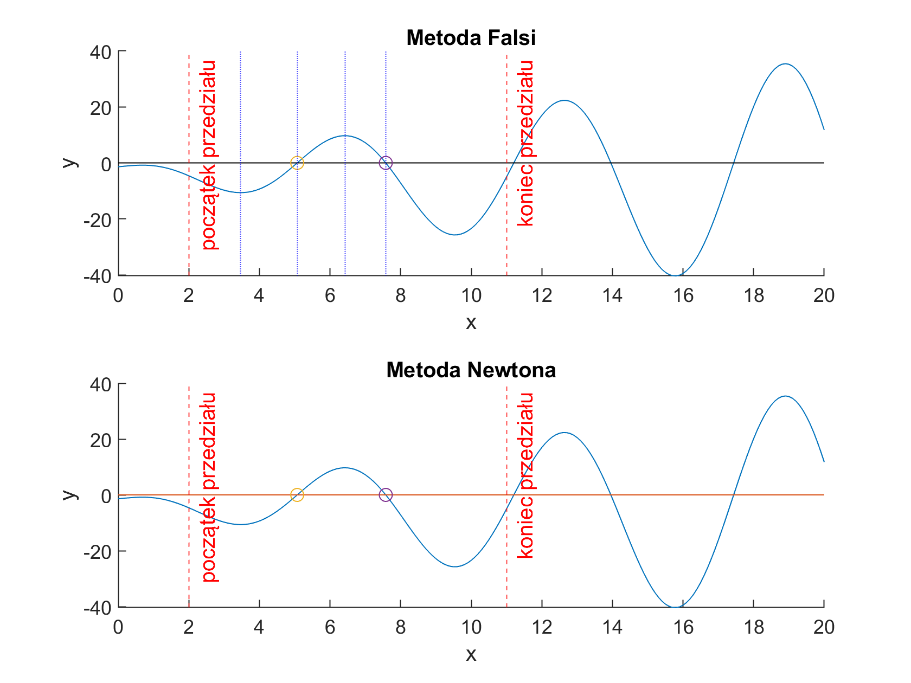
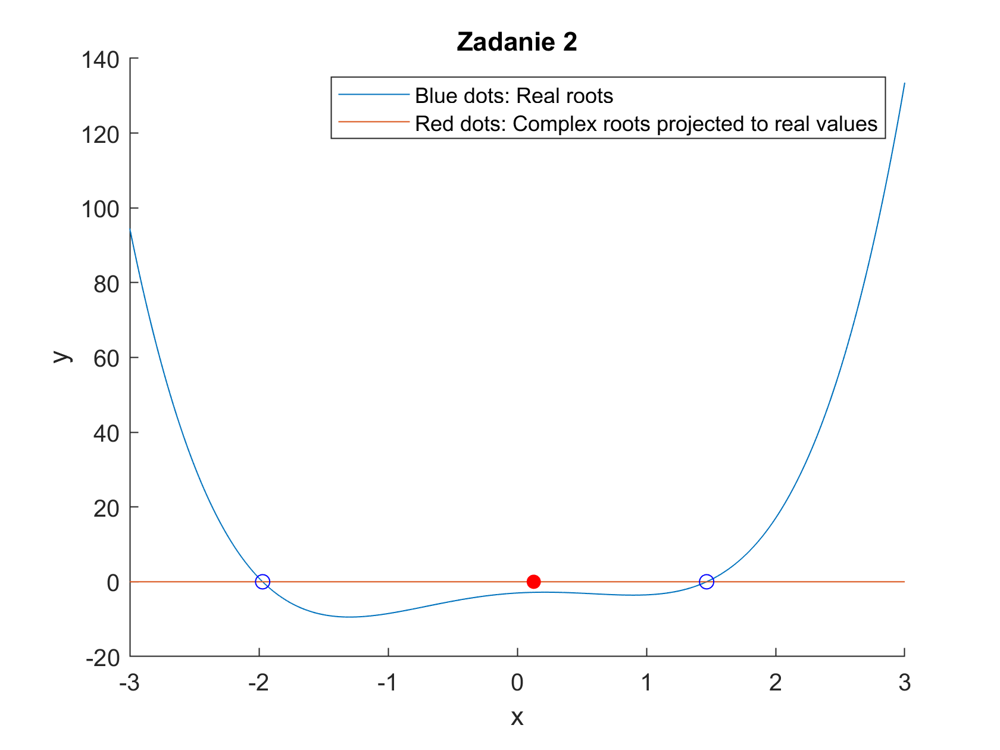

# MNUM Miniprojekt 2
_Richard Staszkiewicz idx. 310918_

## Zadanie 1

### Treść
Proszę znaleźć wszystkie pierwiastki funkcji 
$$
f(x) = 2.2xcos(x) - 2ln(x+2)
$$
w przedziale [2, 11] używając
a) własnego solwera z implementacją metody reguły *falsi*
b) podanego na stronie przedmiotu solwera newton.m z implementacją metody Newtona.

W pliku [function1](function1.m) została zaimplementowana funkcja z zadania.

### Reguła Falsi
Przy zadanej funkcji $f$ ciągłej na przedziale $[a, b]$ przyjmującej na granicach przedziału różne znaki,
można zastosować regułę falsi do znalezienia miejsca zerowego. Iteracyjnie wyznacza się punkt przecięcia c odcinka łączącego
punkty $(a, f(a))$ oraz $(b, f(b))$ z osią OX za pomocą wzoru

$$
c = \frac{af(b) - bf(a)}{f(b) - f(a)}
$$

W następnym kroku rozpatrujemy ten przedział ze zbioru ${[a, c], [c, b]}$ który ma ujemny iloczyn (granice przedziału o różnych znakach).
Kryterium stopu jest $$f(c) < \delta$$ gdzie $\delta$ jest dokładnością. Implementacja powyższego algorytmu jest reprezentowana solverem [solverFalsi](solverFalsi.m).

Sprawdzono zadaną funkcję i dla krańców przedziału $[2, 11]$ otrzymano odpowiednio wartości $[-4.6036, -5.0228]$.
Przedział sam w sobie nie spełnia więc założeń użycia reguły falsi. Z pomocą analizy graficznej narzędziem wolfram alpha stwierdzono także występowanie w tym przedziale 2 miejsc zerowych.

### Metoda Newtona
Metoda Newtona aproksymuje funkcję docelową funkcją liniową wyznaczaną poprzez niepełny szereg Taylora w aktualnym punkcie $x_{i}$ z pomocą wzoru

$$
f(x) \approx f(x_i) + f'(x_i)(x - x_i) 
$$

Kolejny punkt $x_{i+1}$ jest wyliczany z przyrównania do zera aproksymacji liniowej funkcji $f(x)$:

$$
f(x_i) + f'(x_i)(x_{i+1} - x_i) = 0
$$

wyznaczając $x_{i+1}$ otrzymujemy:

$$
x_{i+1} = x_n - \frac{f(x_i)}{f'(x_i)}
$$

Implementacja została udostępniona przez Prowadzącego i znajduje się w pliku [newton](newton.m).

### Przedziały izolacji pierwiastków
Znajdowanie przedziałów izolacji pierwiastków funkcji jest stosunkowo proste i działa na zasadzie zmodyfikowanego algorytmu gąsienicy. Mając zatany krok $\beta$ i granice badanego przedziału $[a, b]$
iteracyjnie wyznaczamy najmniejszy przedział taki że jego krańce są przeciwnych znaków a pochodna nie jest na krańcach równa 0. 

Algorytm izolacji pierwiastków zaimplementowano w pliku [isolation](isolation.m).

### Rozwiązanie
Rezultaty uzyskane przez poszczególne solvery reprezentuje tabela i grafika uzyskana na podstawie procedury [plot_Z1.m](plot_Z1).



_*Falsi*_
| X  | Y  | Iter  | Time  | a  | b  |
|---|---|---|---|---|---|
| 5.0707  | -0.0000 | 100.0000  |  0.0074  |  3.4700  |  5.0800 |
| 7.5795  |  0.0000 | 100.0000  |  0.0011  |  6.4300  |  7.5800 |

_*Newton*_
| X  | Y  | Iter  | Time  | x0 |
|---|---|---|---|---|
| 5.0707  | 0.0000  |  100  |  0.0013  |  6 |
|   7.5795  |  0.0000  | 100  |  0.0001  |  9 |

### Wnioski
Obie metody sprawnie znalazły miejsca zerowe funkcji, przy podobnej ilości iteracji. Metoda Newtona jest minimalnie szybsza licząc executoin time.
Metoda Falsi może zawieść (długo zbiegać) jeśli:
* Jeden z końców przedziałów nie zmienia się przy wielu iteracjach.
_Rozwiązaniem powyższego problemu byłoby zastosowanie algorytmu Illinois ze zbieżnością superliniową._

Metoda Newtona może zawieść (nie znaleźć najbliższego pierwiastka w otoczeniu) jeśli:
* Sotsujemy ją poza obszarem atrakcji pierwiastka
* W okolicy punktu testowego pochoda jest bliska 0 (oddala się wówczas algorytm znacznie od punktu startowego).

## Zadanie 2

### Treść
Używając metody *Mullera MM2* proszę znaleźć wszystkie pierwiastki wielomianu czwartego stopnia:
$$
f(x) = a_{4}x^4 + a_{3}x^3 + a_{2}x^2 + a_{1}x + a_0, [a_4, a_3, a_2, a_1, a_0] = [2, \frac{1}{2}, -5, 2, -3]
$$

### Metoda Mullera 2
Na podstawie wartości wielomianu w zadanym punkcie startowym $x_k$ oraz informacji o jego pierwszej i drugiej pochodnej, MM2 iteracyjnie poprawia położenie do czasu osiągnięcia pierwiasta wielomianu z zadaną dokładnością zgodnie ze wzorem
$$
z_{+,-} = \frac{-2f(x_k)}{f'(x_k)\pm\sqrt{(f'(x_k))^2 - 2f(x_k)f''(x_k)}}

z_{min} = min(z_+, z_-)

x_{k + 1} = x_k + z_{min}
$$

Ponieważ pierwiastki wielomianu mogą być wielokrotne i zespolone, należy w metodzie uwzględnić arytmetykę liczb zespolonych.
Implementacja podstawowego algorytmu MM2 do znajdywania pojedyńczego pierwiastka została zrealizowana w pliku [solverMM2](solverMM2.m).

### Deflacja czynnikiem liniowym
Jej realizacją jest prosty algorytm implementujący schemat Hornera na podstawie wzoru $q_i = a_i + q_{i + i} * \alpha$ . Jest on zaimplementowany jako elemnet funkcji [findPolyZeros](findPolyZeros.m).

### Rozwiązanie
Funkcja [findPolyZeros](findPolyZeros.m) iteracyjnnie znajduje kolejne miejsca zerowe. Algorytm jest prosty:
1. Znajdź miejsce zerowe $x_0$ wielomianu X za pomocą metody MM2
2. Podziel z pomocą schematu Hornera wielomian przez wyrażenie $(x - x_0)$

W rezultacie uruchomienia instrukcji w postaci _findPolyZeros(X, 1e-9, 100)_, tj. z warunkami stopu na błędzie bezwzględnym _x0_ rzędu $10^{-9}$ bądź $iteracje \ge 100$, otrzymano następujące rezultaty:
| *x0* | *iter* |
| :---: | :---: |
| 0.1276 + 0.7090i | 17 |
| 0.1276 - 0.7090i | 10 |
| 1.4660 | 12 |
| -1.9713 | 1 |

W celu zwizualizowania rozwiązania zaimplementowano prosty wyświetlacz znalezionych miejsc zerowych w pliku [plot_Z2](plot_Z2.m), w rezultacie uruchomienia któego otrzymano następujący wykres:



## Kody

### function1.m
```matlab
function y = function1(x)
    y = 2.2 * x * cos(x) - 2 * log(x + 2);
end
```

### solverFalsi.m
```matlab
function [xf, ff, iexe, texe] = solverFalsi(f, a, b, delta, imax)
    stop = false;
    iexe = 0;
    
    tic
    while ~stop
        c = (a * f(b) - b * f(a)) / (f(b) - f(a));
        if f(a) * f(c) < 0
            b = c;
        else
            a = c;
        end
        
        if abs(f(c)) < delta || iexe >= imax - 1
            stop = true;
        end

        iexe = iexe + 1;
    end
    texe = toc;
    xf = c;
    ff = f(c);
end
```
### isolation.m
```matlab
function X = isolation(f, a, b, step)
    syms X
    
    % funkcja pochodnej
    df = matlabFunction(diff(f(X), X));
    
    % się przechodzimy od początku przedziału
    x1 = a;
    x2 = a+step;
    
    zeros_found = 1;
    X = zeros(2, 0);
    
    while x2 <= b
        if f(x1) * f(x2) < 0 % pierwiastek znajduje się w przedziale
            while sign(df(x1)) ~= sign(df(x2)) && df(x1) ~= 0
                x1 = x1 + step; % dociągnij za lokalne ekstremum
            end
            X(1, zeros_found) = x1;
            X(2, zeros_found) = x2;
            zeros_found = zeros_found + 1;
            x1 = x2;
            x2 = x2 + step;
        else
            x2 = x2 + step;
        end
    end
end
```

### plot_Z1.m
```matlab
function [found_zeros, falsi_results, newton_results] = plot_Z1()
    a = 2;
    b = 11;
    start_plot = 0;
    end_plot = 20;
    x = start_plot : 0.1 : end_plot;
    f = @ (x) function1(x);
    delta = eps;
    imax = 100;
    I = isolation(f, a, b, 0.01);
    falsi_results = zeros(6, size(I, 2));
    rg = start_plot : end_plot;
    found_zeros = zeros(1, size(rg, 2));
    newton_results = zeros(5, size(rg, 2));

    for i = 1:size(x, 2)
        y(i) = f(x(i));
    end

    tiledlayout(2, 1);

    nexttile;
    hold on;
    title("Metoda Falsi");
    xlabel("x");
    ylabel("y");
    xline(a, '--r', "początek przedziału");
    xline(b, '--r', "koniec przedziału");

    plot(x, y);
    plot(x, zeros(length(x), 1), "k");
    for i = 1 : size(I, 2)
        xline(I(1, i), ':b');
        xline(I(2, i), ':b');
        [xf, ff, falsi_results(3, i), falsi_results(4, i)] = solverFalsi(f, I(1, i), I(2, i), delta, imax);
        falsi_results(1, i) = xf;
        falsi_results(2, i) = ff;
        falsi_results(5, i) = I(1, i);
        falsi_results(6, i) = I(2, i);
        scatter(xf, ff);
    end
    hold off;


    nexttile;
    hold on;
    title('Metoda Newtona');
    xlabel('x');
    ylabel('y');
    xline(a, '--r', "początek przedziału");
    xline(b, '--r', "koniec przedziału");
    plot(x, y);
    plot(x, zeros(length(x), 1));
    for i = 1 : size(rg, 2)
        [xf, ff, iexe, texe] = newton(f, rg(i), delta, imax);
        newton_results(1, i) = xf;
        newton_results(2, i) = ff;
        newton_results(3, i) = iexe;
        newton_results(4, i) = texe;
        newton_results(5, i) = rg(i);
        found_zeros(1, i) = xf;
    end
    found_zeros = unique(found_zeros);
    found_zeros = found_zeros(found_zeros==real(found_zeros));
    found_zeros = found_zeros(found_zeros >= a & found_zeros <= b);
    scatter(found_zeros, 0);
    hold off;
end
```

### solverMM2.m
```matlab
function [x_i, iter] = solverMM2(X, x1, delta, max_iter)
    iter = 0;
    x_i = x1;
    fx = polyval(X, x_i);

    while abs(fx)>delta && iter<max_iter
        iter = iter + 1;
        
        sqrt_d = sqrt(polyval(polyder(X), x_i)^2 - 2 * polyval(polyder(polyder(X)), x_i));

        if abs(polyval(polyder(X), x_i) + sqrt_d) > abs(polyval(polyder(X), x_i) - sqrt_d)
            z = -2*polyval(X, x_i) / (polyval(polyder(X), x_i) + sqrt_d);
        else
            z = -2*polyval(X, x_i) / (polyval(polyder(X), x_i) - sqrt_d);
        end
        x_i = x_i + z;
        fx = polyval(X, x_i);
    end
end
```
### findPolyZeros.m
```matlab
function [roots, iterations] = findPolyZeros(X, delta, max_iter)
    degree = length(X) - 1;
    roots = zeros(degree, 1);
    iterations = zeros(degree, 1);

    for i = 1:degree
        [roots(i), iterations(i)] = solverMM2(X, 0, delta, max_iter);

        % Horner
        n = length(X);
        new_X = zeros(n, 1);
        for j = 2:n
            new_X(j) = X(j - 1) + new_X(j - 1) * roots(i);
        end

        X = new_X;
    end 
end
```

### plot_Z2.m
```matlab
function plot_Z2(X, delta, max_iter)
    [x0, iter] = findPolyZeros(X, delta, max_iter);
    start_plot = -3; %real(min(x0) - mean(abs(x0)));
    end_plot = 3; %real(max(x0) + mean(abs(x0)));
    x = start_plot : 0.001 : end_plot;
    y = zeros(size(x, 2));
    y0 = zeros(length(x0));
    for i = 1:size(x, 2)
        y(i) = polyval(X, x(i));
    end
    for i = 1:length(x0)
        y0(i) = polyval(X, x0(i));
    end

    tiledlayout(1, 1);

    nexttile;
    hold on;
    title("Zadanie 2");
    xlabel("x");
    ylabel("y");
    plot(x, y);
    for i = 1:length(x0)
        if abs(imag(x0(i))) < delta
            scatter(real(x0(i)), real(y0(i)),'blue');
        else
            scatter(real(x0(i)), real(y0(i)), 'red', 'filled');
        end
    end
    legend("Blue dots: Real roots", "Red dots: Complex roots projected to real values");
    hold off;
end
```